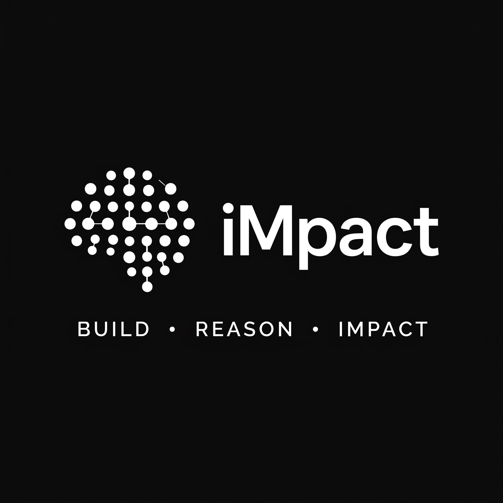
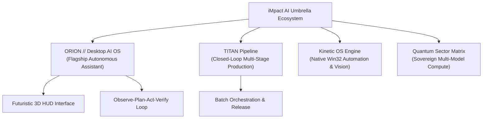

<div align="center">



# iMpact AI
### *Autonomous Sovereign Intelligence, Kinetic Agents & Desktop Operating Systems*

[](https://opensource.org/licenses/MIT)
[]()
[](https://github.com/iMpacts-AI/ORION)
[]()
[]()

**iMpact AI** is an advanced independent artificial intelligence engineering initiative dedicated to pioneering sovereign autonomous operating systems, kinetic computer-use agents, and deterministic safety architectures. Founded and led by independent builder Sheikh Saqib, iMpact develops closed-loop environments where intelligent agents perceive, reason, and actuate directly across native operating systems and real-world computational workflows.

[Vision](#vision) • [Product Ecosystem](#product-ecosystem) • [Core Architecture](#core-architecture) • [Security & Sovereignty](#security--sovereignty) • [Empirical Standards](#empirical-standards--verification) • [Global Collaboration](#global-research--academic-collaboration)

---

</div>

## Vision

The next era of personal and enterprise computing will not take place inside isolated browser chat windows. It belongs to **ambient, sovereign AI operating systems** that run natively alongside human operators—observing desktop context, understanding intent, and executing multi-step computational tasks across applications without friction or simulation.

iMpact AI develops the foundational frameworks and product lines enabling this paradigm:
1. **Kinetic Operating System Control:** Direct, verified OS actuation through native sub-25ms cursor manipulation, window supervision, and application interaction.
2. **Deterministic Safety Containment:** Zero-trust security kernels that prevent unauthorized destructive actions while maximizing autonomous task throughput.
3. **Multi-Sector Neural Routing:** Dynamic, multi-model intelligence that automatically selects the optimal reasoning engine based on task complexity, latency requirements, and privacy constraints.

---

## Product Ecosystem



### 1. ORION (Flagship Operating System)
* **Repository:** [`iMpacts-AI/ORION`](https://github.com/iMpacts-AI/ORION)
* **Category:** Autonomous Desktop AI Operating System
* **Capabilities:** 3D Planetary Torus HUD, full kinetic computer use (mouse, keyboard, app launching), multi-tool execution DAG, multimodal optical screen vision, sub-25ms Win32 input dispatching, and voice synthesis.

### 2. TITAN Pipeline
* **Category:** Closed-Loop Multi-Stage Production Engine
* **Capabilities:** Autonomous asset inspection, quality scoring, draft rendering, and verifiable distribution packaging.

### 3. Kinetic OS Automation Driver
* **Category:** Native Windows & Cross-Platform Hardware Controller
* **Capabilities:** Zero-latency mouse cursor trajectory interpolation, virtual keystroke injection, window focus activation, and screen comprehension.

---

## Core Architecture

iMpact systems are built around the **Observe-Plan-Act-Verify (OPAV)** closed-loop execution lifecycle:

| Stage | Subsystem | Functionality |
| :--- | :--- | :--- |
| **Observe** | `ScreenUnderstandingService` | 1080p display buffer capture, OCR text extraction, UI element hierarchy resolution |
| **Plan** | `ComputerActionPlanner` | Decomposes high-level natural language into deterministic directed acyclic action graphs (DAG) |
| **Gate** | `ActionRiskEvaluator` | 4-tier risk classification, system path allowlisting, human authorization barriers |
| **Act** | `InputControlService` | Sub-25ms cursor movement, native keyboard typing, window focusing, app execution |
| **Verify** | `ComputerActionVerifier` | Optical state diffing, process lifecycle checks, postcondition assertion |

---

## Security & Sovereignty

* **Boundary Containment:** Protected operating system boundaries (`C:\Windows`, `System32`, root system configurations) are strictly blocked by deterministic security kernels.
* **Process Supervision:** Every spawned child process is managed under a supervised process tree with hardware emergency-stop capability (`taskkill /T /F /PID`).
* **Credential Isolation:** All API tokens, session cookies, and system credentials are strictly stored in local encrypted memory environments and never transmitted or logged.

---

## Empirical Standards & Verification

iMpact AI adheres to strict empirical engineering principles:
* **43 / 43 Verified Test Suites** executing across pure process isolation.
* **Real, Unsimulated Hardware Telemetry** polling CPU core loads, memory utilization, GPU buffers, and storage volumes in single-digit milliseconds.
* **Zero Fakes Policy:** Every benchmark, automated test, and demonstration operates against real operating system APIs and actual machine state.

---

## Global Research & Academic Collaboration

iMpact AI is an independent builder initiative engaging with the global AI research and engineering ecosystem:

* **Research Focus:** Autonomous agents, kinetic computer-use systems, local model inference, multimodal perception, and human-computer interaction (HCI).
* **Open Collaboration:** We actively seek technical dialogue, peer review, and collaboration with:
  * University AI & Computer Science Laboratories
  * Fellowships & Independent Builder Programs
  * Advanced Robotics & Systems Research Groups
  * Engineering Foundations & Innovation Hubs Worldwide

```
"The purpose of building is not to create demonstrations, but to engineer real technology that expands human agency."
— Sheikh Saqib, Founder of iMpact AI
```

---

<div align="center">

**iMpact AI — Shaping the Future of Sovereign Autonomous Computing.**  
*Official Website: [https://impacts-ai.com](https://impacts-ai.com) • Inquiries: contact@impacts-ai.com*

</div>
