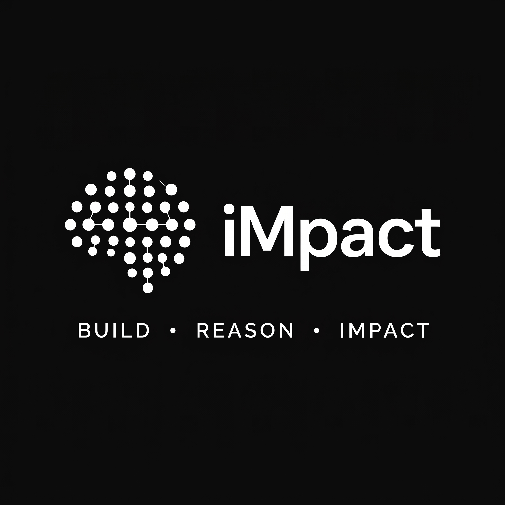
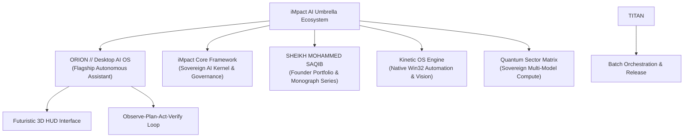

<div align="center">



# iMpact AI
### *Autonomous Sovereign Intelligence, Kinetic Agents & Desktop Operating Systems*

[](https://github.com/iMpacts-AI)
[](https://github.com/iMpacts-AI/Sheikh-Mohammed-Saqib)
[](https://github.com/iMpacts-AI/ORION)
[](https://impacts-ai.com/)
[](https://www.linkedin.com/in/impact-ai)
[](https://www.instagram.com/impacts_ai/)
[](https://www.youtube.com/channel/UCGHBVNRNwYRRfY02yQqemPQ)
[](mailto:saqib@impacts-ai.com)

<br />

> ### **NETWORK &bull; REASON &bull; IMPACT**
> *"The future of computational intelligence will not take place inside browser chat windows. It belongs to ambient, sovereign desktop operating systems capable of perceiving, reasoning, and actuating directly across native environments with kinetic precision."*  
> &mdash; **SHEIKH MOHAMMED SAQIB**, Founder & Chief AI Systems Architect

---

</div>

## 🌌 Vision

The next era of personal and enterprise computing will not take place inside isolated browser chat windows. It belongs to **ambient, sovereign AI operating systems** that run natively alongside human operators—observing desktop context, understanding intent, and executing multi-step computational tasks across applications without friction or simulation.

Founded and spearheaded by **[SHEIKH MOHAMMED SAQIB](https://github.com/iMpacts-AI/Sheikh-Mohammed-Saqib)**, **iMpact AI** develops the foundational frameworks and product lines enabling this paradigm:
1. **Kinetic Operating System Control:** Direct, verified OS actuation through native sub-25ms cursor manipulation, window supervision, and application interaction.
2. **Deterministic Safety Containment:** Zero-trust security kernels that prevent unauthorized destructive actions while maximizing autonomous task throughput.
3. **Multi-Sector Neural Routing:** Dynamic, multi-model intelligence that automatically selects the optimal reasoning engine based on task complexity, latency requirements, and privacy constraints.

```text
┌─────────────────────────────────────────────────────────────────────────────┐
│  impact@sovereign-hq                                                        │
│  ─────────────────────────────────────────────────────────────────────────  │
│         __/\__       Organization: iMpact AI Global Engineering HQ          │
│      .-'  /\  '-.    Motto: Network • Reason • Impact                       │
│     /    /  \    \   Fleet: EMP-001 through EMP-010 Autonomous Agents       │
│    |  .-'    '-.  |  Operating Model: One Tab = Entire Engineering Company  │
│    |  |  /\  |  | |  Secret Gate: Quarantined Secrets (Zero Plaintext)      │
│    |  '-.__.-'  | |  Discord Gateway: iMpact HQ Bot (Zero-Trust Allowlist)  │
│     \    \  /    /   Release Pipeline: TITAN Automated QA & Quality Scorer  │
│      '-.  \/  .-'    Inference: 10-Sector Quantum Fabric Dynamic Fallback   │
│         ~~/\~~       Target: Win32 Desktop • CLI Toolchains • Workflows     │
│       i M P A C T    Founder: Sheikh Mohammed Saqib                         │
│     [ SOVEREIGN ]    Portal: https://impacts-ai.com                         │
│                      Directive: Escaping the Sandbox into Native Agency     │
│                      State: SOVEREIGN // CONTINUOUS AUTONOMY                │
│                                                                             │
│                      ███ ███ ███ ███ ███ ███ ███ ███                        │
└─────────────────────────────────────────────────────────────────────────────┘
```

---

## 🏛️ Product Ecosystem


```mermaid
graph TD
    IMPACT["iMpact AI Umbrella Ecosystem"] --> ORION["ORION // Desktop AI OS\n(Flagship Autonomous Assistant)"]
    IMPACT --> CORE["iMpact Core Framework\n(Sovereign AI Kernel & Governance)"]
    IMPACT --> FOUNDER["SHEIKH MOHAMMED SAQIB\n(Founder Portfolio & Monograph Series)"]
    IMPACT --> KINETIC["Kinetic OS Engine\n(Native Win32 Automation & Vision)"]
    IMPACT --> SECTORS["Quantum Sector Matrix\n(Sovereign Multi-Model Compute)"]

    ORION --> ORION_HUD["Futuristic 3D HUD Interface"]
    ORION --> ORION_EXEC["Observe-Plan-Act-Verify Loop"]
    TITAN --> TITAN_EXP["Batch Orchestration & Release"]
```

### 1. 🌟 [ORION (Flagship Operating System)](https://github.com/iMpacts-AI/ORION)
* **Repository:** [`iMpacts-AI/ORION`](https://github.com/iMpacts-AI/ORION)
* **Category:** Autonomous Desktop AI Operating System
* **Capabilities:** 3D Planetary Torus HUD, full kinetic computer use (mouse, keyboard, app launching), multi-tool execution DAG, multimodal optical screen vision, sub-25ms Win32 input dispatching, and voice synthesis.

### 2. 👑 [SHEIKH MOHAMMED SAQIB (Founder & Chief Architect)](https://github.com/iMpacts-AI/Sheikh-Mohammed-Saqib)
* **Repository:** [`iMpacts-AI/Sheikh-Mohammed-Saqib`](https://github.com/iMpacts-AI/Sheikh-Mohammed-Saqib)
* **Category:** Executive Founder Portfolio, Philosophy & Monograph Series
* **Monographs:** *The Death of the Chatbot Sandbox*, *Deterministic Safety Kernels*, and *Sovereign Multi-Sector Intelligence*.

### 3. ⚡ TITAN Pipeline
* **Category:** Closed-Loop Multi-Stage Production Engine
* **Capabilities:** Autonomous asset inspection, quality scoring, draft rendering, and verifiable distribution packaging.

### 4. 🕹️ Kinetic OS Automation Driver
* **Category:** Native Windows & Cross-Platform Hardware Controller
* **Capabilities:** Zero-latency mouse cursor trajectory interpolation, virtual keystroke injection, window focus activation, and screen comprehension.

---

## ⚙️ Core Architecture

iMpact systems are built around the **Observe-Plan-Act-Verify (OPAV)** closed-loop execution lifecycle:

| Stage | Subsystem | Functionality |
| :--- | :--- | :--- |
| **Observe** | `ScreenUnderstandingService` | 1080p display buffer capture, OCR text extraction, UI element hierarchy resolution |
| **Plan** | `ComputerActionPlanner` | Decomposes high-level natural language into deterministic directed acyclic action graphs (DAG) |
| **Gate** | `ActionRiskEvaluator` | 4-tier risk classification, system path allowlisting, human authorization barriers |
| **Act** | `InputControlService` | Sub-25ms cursor movement, native keyboard typing, window focusing, app execution |
| **Verify** | `ComputerActionVerifier` | Optical state diffing, process lifecycle checks, postcondition assertion |

---

## 🔒 Security & Sovereignty

* **Boundary Containment:** Protected operating system boundaries (`C:\Windows`, `System32`, root system configurations) are strictly blocked by deterministic security kernels.
* **Process Supervision:** Every spawned child process is managed under a supervised process tree with hardware emergency-stop capability (`taskkill /T /F /PID`).
* **Credential Isolation:** All API tokens, session cookies, and system credentials are strictly stored in local encrypted memory environments and never transmitted or logged.

---

## 📊 Empirical Standards & Verification

iMpact AI adheres to strict empirical engineering principles:
* **43 / 43 Verified Test Suites** executing across pure process isolation.
* **Real, Unsimulated Hardware Telemetry** polling CPU core loads, memory utilization, GPU buffers, and storage volumes in single-digit milliseconds.
* **Zero Fakes Policy:** Every benchmark, automated test, and demonstration operates against real operating system APIs and actual machine state.

---

## 🔬 Global Research & Academic Collaboration

iMpact AI is an independent builder initiative engaging with the global AI research and engineering ecosystem:

* **Research Focus:** Autonomous agents, kinetic computer-use systems, local model inference, multimodal perception, and human-computer interaction (HCI).
* **Open Collaboration:** We actively seek technical dialogue, peer review, and collaboration with:
  * University AI & Computer Science Laboratories
  * Fellowships & Independent Builder Programs
  * Advanced Robotics & Systems Research Groups
  * Engineering Foundations & Innovation Hubs Worldwide

```
"The purpose of building is not to create demonstrations, but to engineer real technology that expands human agency."
— SHEIKH MOHAMMED SAQIB, Founder & Chief AI Systems Architect
```

---

<div align="center">

**iMpact AI &bull; Shaping the Future of Sovereign Autonomous Computing.**  
*Official Portal: [https://impacts-ai.com](https://impacts-ai.com) &bull; Founder: [SHEIKH MOHAMMED SAQIB](https://github.com/iMpacts-AI/Sheikh-Mohammed-Saqib) &bull; Inquiries & Contact: [saqib@impacts-ai.com](mailto:saqib@impacts-ai.com)*

</div>
