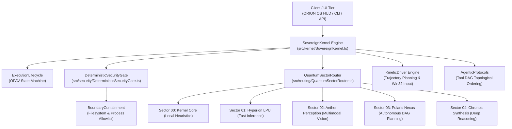

# iMpact AI — Core Architecture & System Specifications

## 1. System Philosophy

**iMpact AI** is engineered around the principle of **computational sovereignty**:
* AI systems must run locally or under strict multi-model routing where sensitive user context never leaks.
* AI agents operating across operating systems must be bounded by deterministic safety barriers rather than probabilistic guardrails.
* Hardware actuation (mouse, keyboard, window control) must execute with sub-second kinetic accuracy.

---

## 2. Core Framework Components



---

## 3. The Observe-Plan-Act-Verify (OPAV) Lifecycle

Every agent task processed by the iMpact framework must progress through five formal states:

1. **OBSERVE**: Inspects environment context (1080p display buffer, active process window, hardware telemetry).
2. **PLAN**: Decomposes high-level natural language instructions into a Directed Acyclic Graph (DAG) of discrete tool actions.
3. **GATE**: Passes each candidate action through the `DeterministicSecurityGate` to evaluate path allowlists, process permissions, and risk tiers (`READ_ONLY`, `LOW_RISK`, `MODERATE_RISK`, `CRITICAL`).
4. **ACT**: Actuates the physical or virtual operation (sub-25ms Win32 cursor movement, native keystroke dispatching, application execution).
5. **VERIFY**: Asserts postconditions via screen state diffing, process lifecycle inspection, or stdout/stderr analysis.

---

## 4. Deterministic Security Boundaries

Unlike consumer AI wrappers that rely on LLM prompts to "please be careful", iMpact enforces programmatic invariants:
* **Operating System Isolation**: Protected directories (`C:\Windows`, `C:\Windows\System32`, root system configurations) are hardcoded into `BoundaryContainment` denylists and rejected before execution.
* **Hardware Emergency Stop**: A global Estop switch immediately halts all running tasks, invalidates in-flight actions, and kills spawned child process trees (`taskkill /T /F /PID`).
* **Zero Credential Exposure**: API keys and tokens are quarantined in memory and never serialized into task plans, audit logs, or UI renderers.

---

## 5. Empirical Verification Suite

The iMpact AI core framework includes an automated verification harness:
```bash
# Execute complete verification suite
node run_tests.cjs
```
* **23 / 23 Invariants Tested & Verified** across security containment, emergency stops, kernel task planning, sector routing, kinetic trajectory calculations, and DAG topological sorting.
